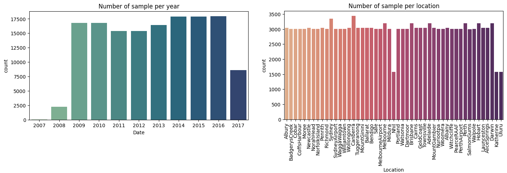
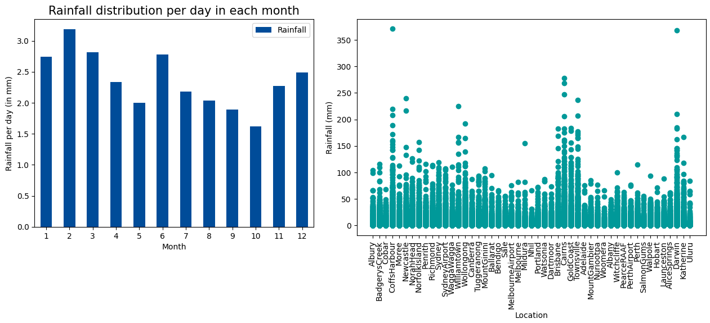
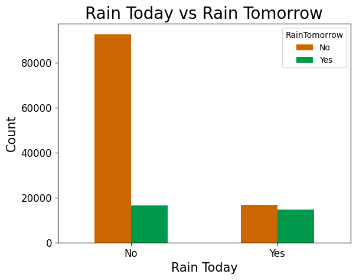

# Assignment 1: Tabular Data
*Group TN01 - Team SEML31*

> **Colab Notebook:** 

## The problem

- **Dataset:** [Rain in Australia](https://www.kaggle.com/datasets/jsphyg/weather-dataset-rattle-package/)
    + Tabular dataset type.
    + 10 years of daily weather observations from numerous Australian weather stations.
- Given the data of the current day, we need to predict whether it would rain the following day.
- **Binary classification model:** For each sample in the dataset (a row in the table)
    + **Input:** The features of a sample.
    + **Output:** The prediction of that sample (rain or no rain tomorrow).

## Exploratory Data Analysis (EDA)

- The dataset table has shape `(145460, 23)`. There are 145000+ samples, and 23 columns including the label `RainTomorrow`.
    + Numerical columns: `['MinTemp', 'MaxTemp', 'Rainfall', 'Evaporation', 'Sunshine', 'WindGustSpeed', 'WindSpeed9am', 'WindSpeed3pm', 'Humidity9am', 'Humidity3pm', 'Pressure9am', 'Pressure3pm', 'Cloud9am', 'Cloud3pm', 'Temp9am', 'Temp3pm']`
    + Categorical columns: `['Date', 'Location', 'WindGustDir', 'WindDir9am', 'WindDir3pm', 'RainToday', 'RainTomorrow']`
- The number of sample stay consistantly high from 2009 to 2016, with consistant sample all around Australia.  

- Rainfall can varied by month. According to [www.australia.com](https://www.australia.com/en/facts-and-planning/when-to-go/australias-seasons.html), the rainy season in North Australia falls between November and April. Some location may rain more than the others.  

- If it doesn't rain today, then it's likely that it won't rain tomorrow.  

- The correlation matrix shows that temperature, evaporation, humidity, and pressure are quite correlated. Among the various numerical features, humidity has the most correlation with rainfall.  

## Preprocess

The preprocess pipeline has the following configurations:
- **`up_sampling`**: If `True`, upsample the "No" label samples to be equal to the number of "Yes" label samples. If `False`, downsamlpe the "Yes" label.
- **`drop_outlier`**: If `True`, drop the samples that contain outlier features. For each numerical feature, the outlier range is determined to be from the first quartile to the third quartile.
- **`fill_na`**: Replace the NaN values with the `median` or the `mean` of the column.
- **`cat_encode`**: Encoding `ordinal` or `onehot`  for categorical columns.
- **`scale`**: Can be `norm` or `minmax` scaler
- **`pca_variance`**: Float value between 0 and 1.

The preprocess pipeline also splits the `Date` column into day, month, year; drop the rows where the label `RainTomorrow` is NaN; and splits the dataset into train and test sets.

## Training result

The following preprocess configuration is chosen for training. We have a total of $2\cdot 2\cdot 2 = 8$ preprocessing combinations.
1.   `fill_na`: median, mean
2.   `cat_encode`: ordinal, onehot
3.   `pca_variance`: 0.9, None

We used 5 machine learning models, trained using **Scikit-learn** and **PyTorch** with the following configurations:
1. **K-Nearest Neighbors**, `n_neighbors`: 5, 11
2. **Logistic Regression**, `penalty`: l2, None
3. **Random Forests**, `n_estimators`: 50, 100
4. **XGBoost**, `learning_rate`: 0.1, 0.3
5. **MLP** (pytorch), `num_hidden`: 2, 3

In total, with 10 model configurations, each trained with 8 preprocessed configurations, we get a total of **80 models**.
Here we only show the result table of XGBoost, with the highest f1-score model highlighted (click [here](https://colab.research.google.com/github/phamtranminhtri/SEML31/blob/main/notebooks/assignment-1.ipynb#scrollTo=2dh5jK-w1YPY&line=1&uniqifier=1) to see the rest):

<table class="tg"><thead>
  <tr>
    <th class="tg-uzvj">model_config</th>
    <th class="tg-uzvj">fill_na</th>
    <th class="tg-uzvj">encode</th>
    <th class="tg-uzvj">pca</th>
    <th class="tg-uzvj">accuracy</th>
    <th class="tg-uzvj">precision</th>
    <th class="tg-uzvj">recall</th>
    <th class="tg-uzvj">f1</th>
  </tr></thead>
<tbody>
  <tr>
    <td class="tg-cly1">0.1</td>
    <td class="tg-cly1">median</td>
    <td class="tg-cly1">ordinal</td>
    <td class="tg-cly1">0.9</td>
    <td class="tg-cly1">0.818974</td>
    <td class="tg-cly1">0.818315</td>
    <td class="tg-cly1">0.78145</td>
    <td class="tg-cly1">0.799458</td>
  </tr>
  <tr>
    <td class="tg-cly1">0.1</td>
    <td class="tg-cly1">median</td>
    <td class="tg-cly1">ordinal</td>
    <td class="tg-cly1">None</td>
    <td class="tg-cly1">0.840999</td>
    <td class="tg-cly1">0.851672</td>
    <td class="tg-cly1">0.79392</td>
    <td class="tg-cly1">0.821783</td>
  </tr>
  <tr>
    <td class="tg-cly1">0.1</td>
    <td class="tg-cly1">median</td>
    <td class="tg-cly1">onehot</td>
    <td class="tg-cly1">0.9</td>
    <td class="tg-cly1">0.819261</td>
    <td class="tg-cly1">0.816677</td>
    <td class="tg-cly1">0.784723</td>
    <td class="tg-cly1">0.800382</td>
  </tr>
  <tr>
    <td class="tg-cly1">0.1</td>
    <td class="tg-cly1">median</td>
    <td class="tg-cly1">onehot</td>
    <td class="tg-cly1">None</td>
    <td class="tg-cly1">0.839919</td>
    <td class="tg-cly1">0.851417</td>
    <td class="tg-cly1">0.791426</td>
    <td class="tg-cly1">0.820326</td>
  </tr>
  <tr>
    <td class="tg-cly1">0.1</td>
    <td class="tg-cly1">mean</td>
    <td class="tg-cly1">ordinal</td>
    <td class="tg-cly1">0.9</td>
    <td class="tg-cly1">0.819333</td>
    <td class="tg-cly1">0.818256</td>
    <td class="tg-cly1">0.782541</td>
    <td class="tg-cly1">0.8</td>
  </tr>
  <tr>
    <td class="tg-cly1">0.1</td>
    <td class="tg-cly1">mean</td>
    <td class="tg-cly1">ordinal</td>
    <td class="tg-cly1">None</td>
    <td class="tg-cly1">0.846757</td>
    <td class="tg-cly1">0.863097</td>
    <td class="tg-cly1">0.794076</td>
    <td class="tg-cly1">0.827149</td>
  </tr>
  <tr>
    <td class="tg-cly1">0.1</td>
    <td class="tg-cly1">mean</td>
    <td class="tg-cly1">onehot</td>
    <td class="tg-cly1">0.9</td>
    <td class="tg-cly1">0.819405</td>
    <td class="tg-cly1">0.817045</td>
    <td class="tg-cly1">0.784567</td>
    <td class="tg-cly1">0.800477</td>
  </tr>
  <tr>
    <td class="tg-cly1">0.1</td>
    <td class="tg-cly1">mean</td>
    <td class="tg-cly1">onehot</td>
    <td class="tg-cly1">None</td>
    <td class="tg-cly1">0.845966</td>
    <td class="tg-cly1">0.864574</td>
    <td class="tg-cly1">0.790179</td>
    <td class="tg-cly1">0.825705</td>
  </tr>
  <tr>
    <td class="tg-cly1">0.3</td>
    <td class="tg-cly1">median</td>
    <td class="tg-cly1">ordinal</td>
    <td class="tg-cly1">0.9</td>
    <td class="tg-cly1">0.829986</td>
    <td class="tg-cly1">0.829138</td>
    <td class="tg-cly1">0.795791</td>
    <td class="tg-cly1">0.812122</td>
  </tr>
  <tr>
    <td class="tg-cly1">0.3</td>
    <td class="tg-cly1">median</td>
    <td class="tg-cly1">ordinal</td>
    <td class="tg-cly1">None</td>
    <td class="tg-cly1">0.846469</td>
    <td class="tg-cly1">0.851907</td>
    <td class="tg-cly1">0.80795</td>
    <td class="tg-cly1">0.829346</td>
  </tr>
  <tr>
    <td class="tg-cly1">0.3</td>
    <td class="tg-cly1">median</td>
    <td class="tg-cly1">onehot</td>
    <td class="tg-cly1">0.9</td>
    <td class="tg-cly1">0.826315</td>
    <td class="tg-cly1">0.825049</td>
    <td class="tg-cly1">0.791738</td>
    <td class="tg-cly1">0.80805</td>
  </tr>
  <tr>
    <td class="tg-cly1">0.3</td>
    <td class="tg-cly1">median</td>
    <td class="tg-cly1">onehot</td>
    <td class="tg-cly1">None</td>
    <td class="tg-cly1">0.849061</td>
    <td class="tg-cly1">0.853934</td>
    <td class="tg-cly1">0.812003</td>
    <td class="tg-cly1">0.832441</td>
  </tr>
  <tr>
    <td class="tg-cly1">0.3</td>
    <td class="tg-cly1">mean</td>
    <td class="tg-cly1">ordinal</td>
    <td class="tg-cly1">0.9</td>
    <td class="tg-cly1">0.831138</td>
    <td class="tg-cly1">0.829154</td>
    <td class="tg-cly1">0.798909</td>
    <td class="tg-cly1">0.81375</td>
  </tr>
  <tr>
    <td class="tg-n863">0.3</td>
    <td class="tg-n863">mean</td>
    <td class="tg-n863">ordinal</td>
    <td class="tg-n863">None</td>
    <td class="tg-n863">0.850932</td>
    <td class="tg-n863">0.860438</td>
    <td class="tg-n863">0.808262</td>
    <td class="tg-n863">0.833534</td>
  </tr>
  <tr>
    <td class="tg-cly1">0.3</td>
    <td class="tg-cly1">mean</td>
    <td class="tg-cly1">onehot</td>
    <td class="tg-cly1">0.9</td>
    <td class="tg-cly1">0.830922</td>
    <td class="tg-cly1">0.830569</td>
    <td class="tg-cly1">0.796259</td>
    <td class="tg-cly1">0.813052</td>
  </tr>
  <tr>
    <td class="tg-cly1">0.3</td>
    <td class="tg-cly1">mean</td>
    <td class="tg-cly1">onehot</td>
    <td class="tg-cly1">None</td>
    <td class="tg-cly1">0.850788</td>
    <td class="tg-cly1">0.861352</td>
    <td class="tg-cly1">0.806703</td>
    <td class="tg-cly1">0.833132</td>
  </tr>
</tbody></table>

Comparing the highest f1 score configurations in each type of model against each other:

<table class="tg"><thead>
  <tr>
    <th class="tg-7btt">classifier</th>
    <th class="tg-7btt">model_config</th>
    <th class="tg-7btt">fill_na</th>
    <th class="tg-7btt">encode</th>
    <th class="tg-7btt">pca</th>
    <th class="tg-7btt">accuracy</th>
    <th class="tg-7btt">precision</th>
    <th class="tg-7btt">recall</th>
    <th class="tg-7btt">f1</th>
  </tr></thead>
<tbody>
  <tr>
    <td class="tg-0pky">K-Nearest Neighbors</td>
    <td class="tg-0pky">11</td>
    <td class="tg-0pky">mean</td>
    <td class="tg-0pky">onehot</td>
    <td class="tg-0pky">None</td>
    <td class="tg-0pky">0.814223</td>
    <td class="tg-0pky">0.813645</td>
    <td class="tg-0pky">0.775214</td>
    <td class="tg-0pky">0.793965</td>
  </tr>
  <tr>
    <td class="tg-0pky">Logistic Regression</td>
    <td class="tg-0pky">None</td>
    <td class="tg-0pky">median</td>
    <td class="tg-0pky">onehot</td>
    <td class="tg-0pky">None</td>
    <td class="tg-0pky">0.777442</td>
    <td class="tg-0pky">0.769243</td>
    <td class="tg-0pky">0.739984</td>
    <td class="tg-0pky">0.754330</td>
  </tr>
  <tr>
    <td class="tg-0pky">Random Forest</td>
    <td class="tg-0pky">100</td>
    <td class="tg-0pky">mean</td>
    <td class="tg-0pky">ordinal</td>
    <td class="tg-0pky">None</td>
    <td class="tg-0pky">0.836536</td>
    <td class="tg-0pky">0.845103</td>
    <td class="tg-0pky">0.790959</td>
    <td class="tg-0pky">0.817135</td>
  </tr>
  <tr>
    <td class="tg-46ru">XGBoost</td>
    <td class="tg-46ru">0.3</td>
    <td class="tg-46ru">mean</td>
    <td class="tg-46ru">ordinal</td>
    <td class="tg-46ru">None</td>
    <td class="tg-46ru">0.850932</td>
    <td class="tg-46ru">0.860438</td>
    <td class="tg-46ru">0.808262</td>
    <td class="tg-46ru">0.833534</td>
  </tr>
  <tr>
    <td class="tg-0pky">MLP</td>
    <td class="tg-0pky">2</td>
    <td class="tg-0pky">median</td>
    <td class="tg-0pky">onehot</td>
    <td class="tg-0pky">None</td>
    <td class="tg-0pky">0.815950</td>
    <td class="tg-0pky">0.781770</td>
    <td class="tg-0pky">0.834295</td>
    <td class="tg-0pky">0.807179</td>
  </tr>
</tbody></table>

## Remark

- Among all models with their best configurations, **XGBoost** is the model with the highest f1-score. This suggests it has good performance in handling tabular data.
- **PCA**: For the best performing configurations, PCA was not applied (`pca=None`). This suggests that the original feature space was more effective for these models.
- **Encoding**: Both `ordinal` and `onehot` encoding methods is effective depending on the model.
- **Imputation**: Both `median` and `mean` imputation give good results, this can mean this step doesn't affect the performance much.