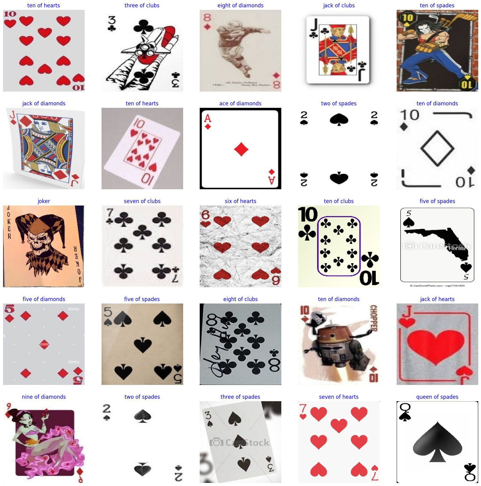
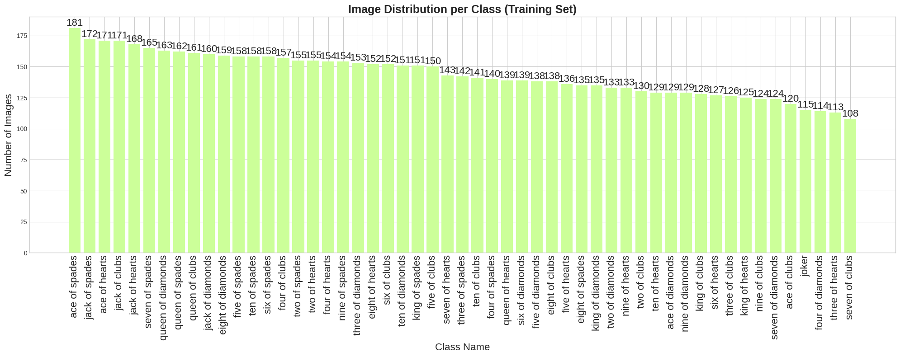
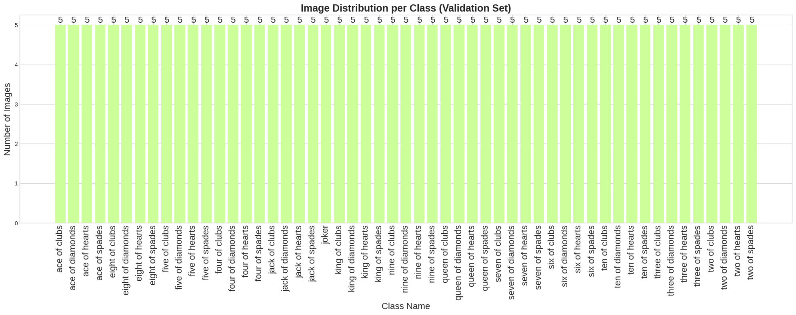
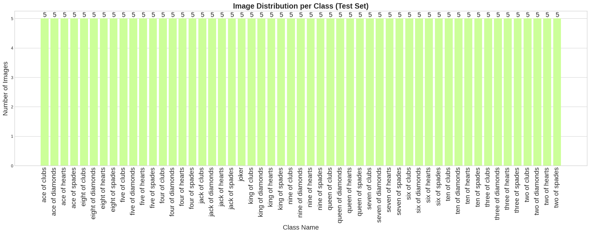
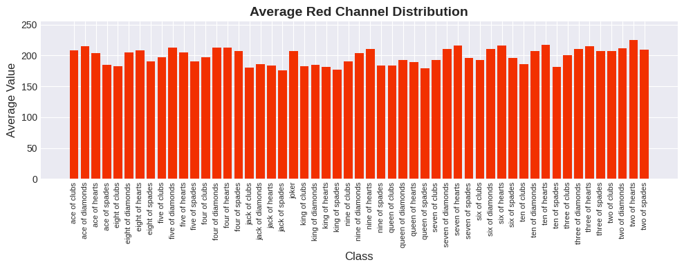
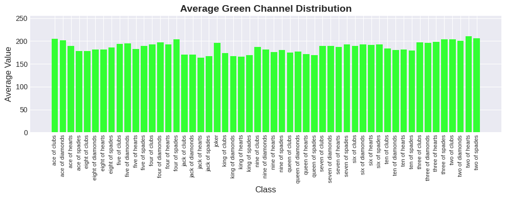
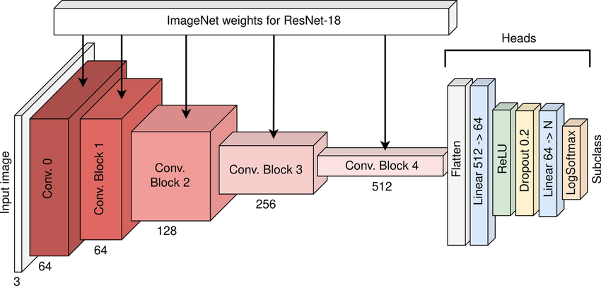
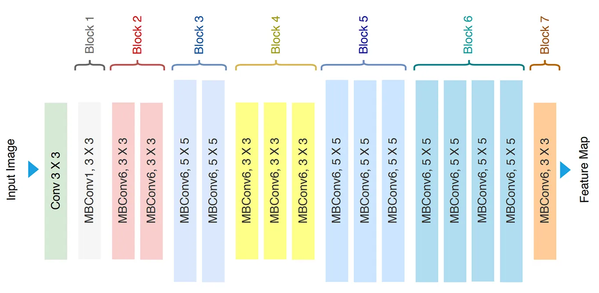
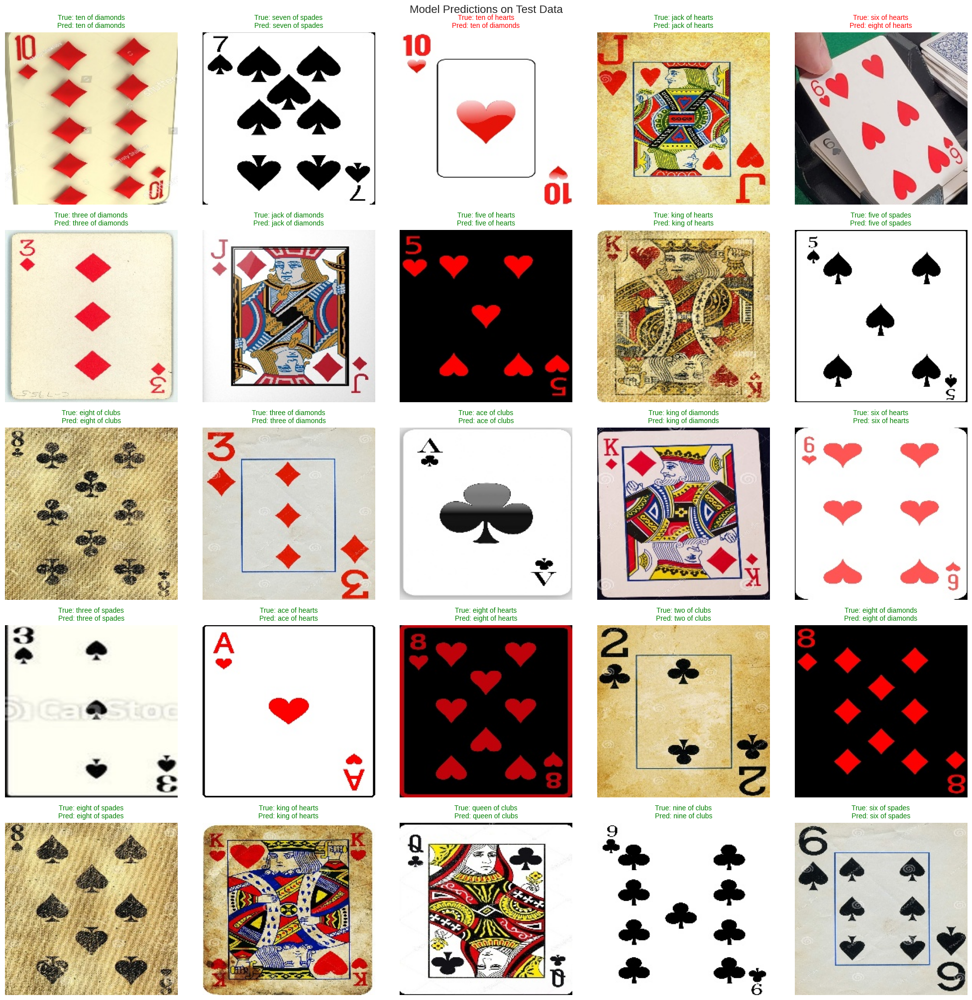

# Assignment 3: Image Data
*Group TN01 - Team SEML31*  

> **Colab Notebook:** 

## Overview
- **Dataset:** [Cards Image Dataset](https://www.kaggle.com/datasets/gpiosenka/cards-image-datasetclassification?select=cards.csv)  
   + Image classification dataset.
   + Contains 8154 images of playing cards.  
- Given an image of a playing card, we need to classify it into one of the 53 distinct classes (52 standard playing card classes and the Joker).
- **Multi-class classification model:**
    + **Input:** An RGB image of a playing card.
    + **Output:** The class label (e.g., 'ace of spades', 'queen of hearts', 'joker').

## Exploratory Data Analysis (EDA)

- The dataset is divided into Train, Validation, and Test sets.
- All images have a consistent shape of `(224, 224)` with 3 color channels (RGB).
- There are **53 classes** in total, covering all standard playing cards and the joker.
- Some sample data from the trainning set:

- Label distribution across the training, validation, and test sets

- Color distribution (RGB) across the dataset

## Choosing Pretrained Models
We use ResNet (ResNet18, ResNet34, ResNet50) and EfficientNet (EfficientNet-B0, EfficientNet-B3) as backbone networks to extract features and perform model training.
- ResNet18 architecture

- EfficientNet-B0 architecture

## Training result

We experimented with several pretrained model as the backbone for feature extraction, combined with different classifiers.

**Backbone Models:**
1.  **ResNet**: `resnet18`, `resnet34`, `resnet50`
2.  **EfficientNet**: `efficientnet_b0`, `efficientnet_b3`

**Classifiers & Configurations:**
1.  **Head-classifier Fine-tuning (Frozen Backbone)**: We fine-tuned only the MLP classifier while keeping the backbone frozen.
2.  **End-to-End Fine-tuning**: We fine-tuned the entire network with an **MLP** classifier attached.

**Results:**

The table below summarizes the performance (accuracy, precision, recall, and f1-score) of the various configurations (click [here](https://colab.research.google.com/github/phamtranminhtri/SEML31/blob/main/notebooks/assignment-3.ipynb#scrollTo=2xWqQfHzUXKQ) for more details)

| Base Model | Classifier | Config | Accuracy | Precision | Recall | F1-Score |
| :--- | :--- | :--- | :--- | :--- | :--- | :--- |
| **resnet18** | **MLP** | **end_to_end** | **0.9698** | **0.9766** | **0.9698** | **0.9696** |
| resnet34 | MLP | end_to_end | 0.9585 | 0.9666 | 0.9585 | 0.9582 |
| resnet50 | MLP | end_to_end | 0.9585 | 0.9689 | 0.9585 | 0.9589 |
| efficientnet_b0 | MLP | end_to_end | 0.8981 | 0.9143 | 0.8981 | 0.8953 |
| efficientnet_b3 | MLP | end_to_end | 0.9321 | 0.9439 | 0.9321 | 0.9296 |
| resnet18 | MLP | head_classifier | 0.5396 | 0.5790 | 0.5396 | 0.5193 |
| resnet34 | MLP | head_classifier | 0.4604 | 0.5289 | 0.4604 | 0.4325 |
| resnet50 | MLP | head_classifier | 0.5585 | 0.5921 | 0.5585 | 0.5332 |
| efficientnet_b0 | MLP | head_classifier | 0.5472 | 0.6181 | 0.5472 | 0.5319 |
| efficientnet_b3 | MLP | head_classifier | 0.5509 | 0.5974 | 0.5509 | 0.5339 |

The **ResNet18** model trained **end-to-end** with an **MLP** classifier achieved the highest performance with an F1-score of **0.9696**.

## Sample Visual Evaluations on the Test Dataset
We run our best model (ResNet18) on random samples from the test dataset and visualize the results.

## Summary
This project applies pretrained CNN models to classify 53 types of playing cards, achieving strong performance with ResNet18 fine-tuned end-to-end, reaching an F1-score of 0.9696. While the results are highly accurate, the model still shows limitations in generalizing to visually similar card classes. Future work will focus on data augmentation, handling class confusion, and exploring lightweight models for faster real-world deployment.