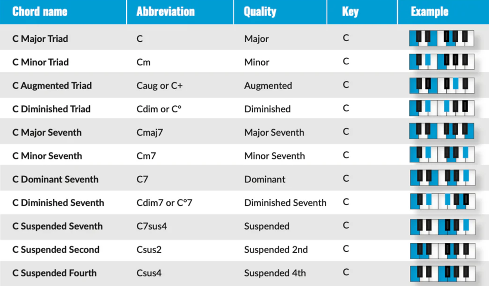
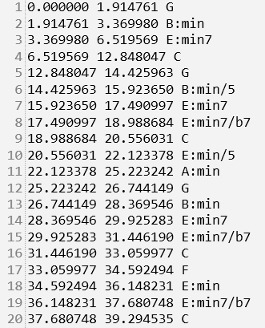
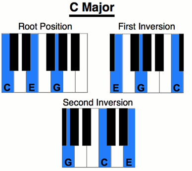
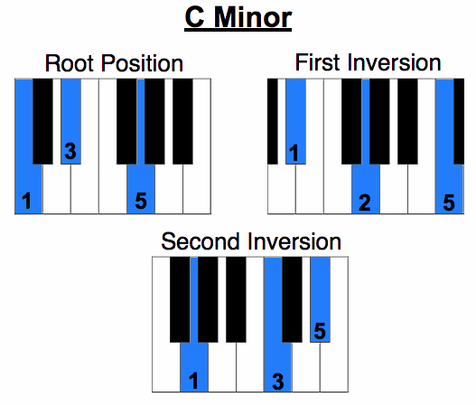
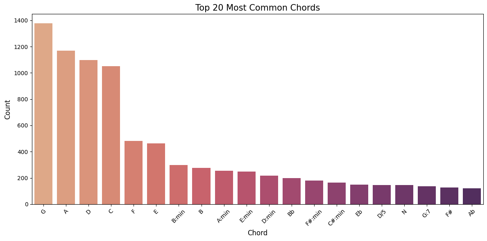
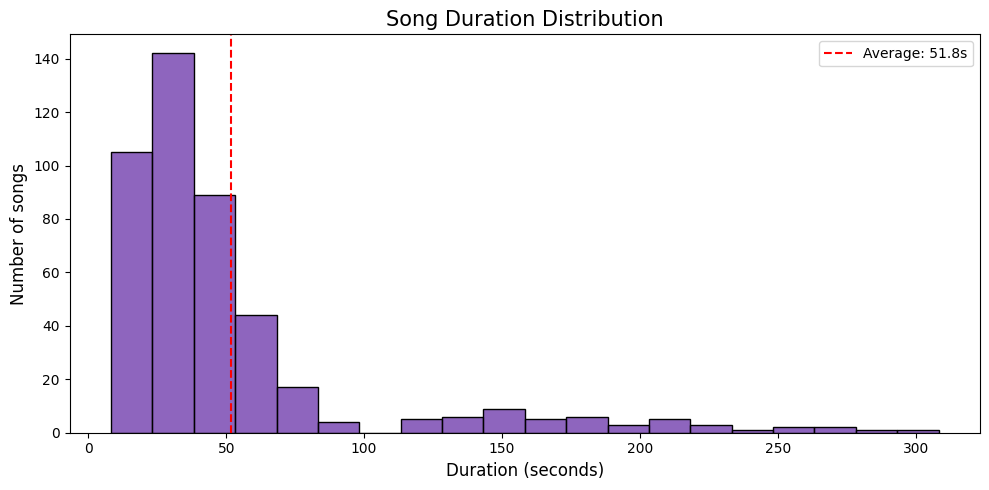
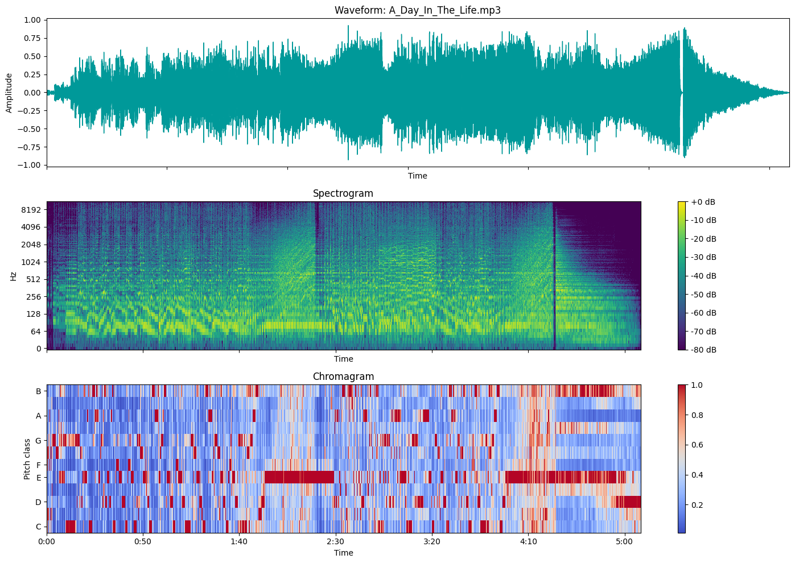
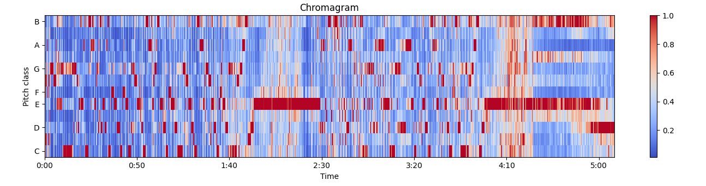

# Assignment Extension: Chord Recognition
**Group TN01 - Team SEML31**  
**Dataset:** [Reference Annotations: The Beatles](http://isophonics.net/content/reference-annotations-beatles)
> **Colab Notebook:** [Chord_Recognition.ipynb - Colab](https://colab.research.google.com/github/your-repo/Chord_Recognition.ipynb)
---

# Introduction

This project addresses the problem of chord sequence recognition in music audio using a Hidden Markov Model (HMM).

**Applications:**

- Musicians can play songs by following the chord progression without full score knowledge.  
- AI music generation systems can use chord sequences to synthesize music automatically.  

We begin with a brief review of the basic music theory concepts.

---

# Basic Music Theory

## Pitch and Duration

In the Western music system, one octave contains **12 notes**, with **A4 = 440 Hz** as the standard tuning reference.  
The pitch of all other notes is calculated relative to this reference.

## Fundamental Chords

Among various chord types, the two most common are:

- Major chords  
- Minor chords  

Complex chords occur less frequently. Therefore, in this project, all uncommon chords are converted to either major or minor before training the model.

Each of the 12 notes can serve as the root of one major and one minor chord → **24 states**.  
An additional state **N** is added to represent silent sections (no chord).

---

# Dataset

The dataset consists of **50 songs by The Beatles**, each including:

- Audio file in MP3 format  
- Annotation file (`.lab`) containing chord labels with timing:  
  `start_time  end_time  chord_label`

  

Each song is randomly segmented into **8 sections** to enable the model to learn intermediate musical segments.

Corresponding `.lab` files are generated for each audio segment.

  

---

# Exploratory Data Analysis (EDA)

## Most Frequent Chords

**Audio segment statistics:**

- Number of segments analyzed: 450  
- Average duration: 51.78 seconds  
- Shortest duration: 8.24 seconds  
- Longest duration: 308.30 seconds  

## Visualization

Example: **A_Day_In_The_Life.mp3**

---

# Feature Extraction

## 1. HPSS (Harmonic/Percussive Source Separation)

Separates harmonic and percussive components to remove drum signals, which do not contribute to chord recognition.

## 2. Chroma CQT & Tonnetz

Measures the energy of the 12 pitch classes in each time frame.

## 3. Additional Processing

- Median filtering  
- Normalization  

---

# HMM Model

(Viterbi algorithm implementation will be described in subsequent sections.)

---

# Results

## Evaluation Metrics

