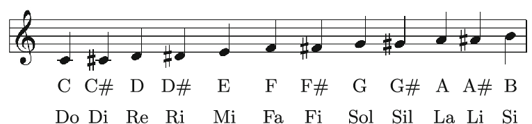
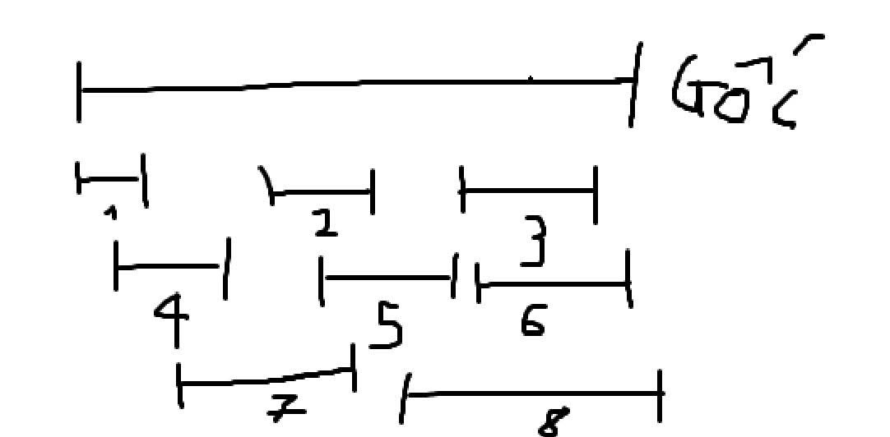
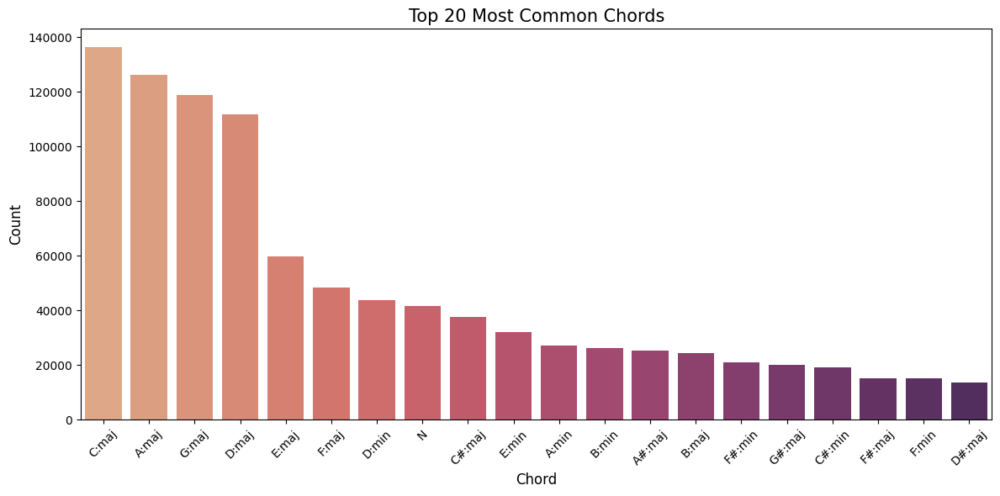
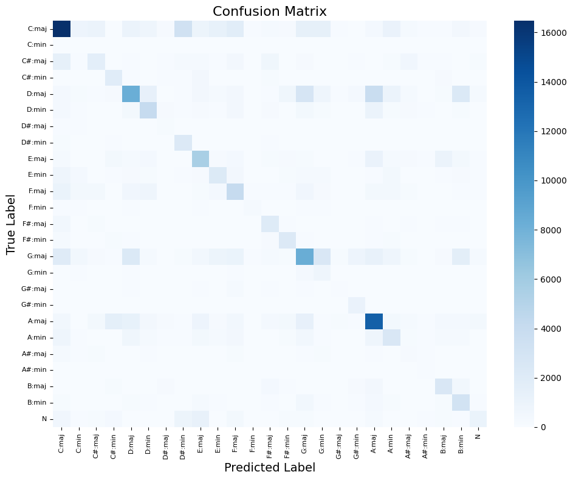

# Assignment Extension: Chord Recognition
**Group TN01 - Team SEML31**  
**Dataset:** [Reference Annotations: The Beatles](http://isophonics.net/content/reference-annotations-beatles)
> **Colab Notebook:** [Chord_Recognition.ipynb - Colab](https://colab.research.google.com/drive/1Aln8cKUV86DrpdODOCq5xshaCkAdy1pd?usp=sharing)
---

# Introduction

This project addresses the problem of chord sequence recognition in music audio using a Hidden Markov Model (HMM).

**Applications:**

- Musicians can play songs by following the chord progression without full score knowledge.  
- AI music generation systems can use chord sequences to synthesize music automatically.  

We begin with a brief review of the basic music theory concepts.

---

# Basic Music Theory

## Pitch

In the Western music system, one octave contains **12 notes**, with **A4 = 440 Hz** as the standard tuning reference.  
The pitch of all other notes is calculated relative to this reference.

## Fundamental Chords

Among various chord types, the two most common are:

- Major chords  
- Minor chords  

Complex chords occur less frequently. Therefore, in this project, all uncommon chords are converted to either major or minor before training the model.

Each of the 12 notes can serve as the root of one major and one minor chord → **24 states**.  
An additional state **N** is added to represent silent sections (no chord).

---

# Dataset

The dataset consists of **50 songs by The Beatles**, each including:

- Audio file in MP3 format  
- Annotation file (`.lab`) containing chord labels with timing:  
  `start_time  end_time  chord_label`

  

Each song is randomly segmented into **8 sections** to enable the model to learn intermediate musical segments.

Corresponding `.lab` files are generated for each audio segment.

---

# Exploratory Data Analysis (EDA)

## Most Frequent Chords

**Audio segment statistics:**

- Number of segments analyzed: 450  
- Average duration: 51.78 seconds  
- Shortest duration: 8.24 seconds  
- Longest duration: 308.30 seconds  

## Visualization

Example: **A_Day_In_The_Life.mp3**

---

# Feature Extraction

The feature extraction pipeline uses **Librosa** library with a sample rate of **22050 Hz** and hop length of **512 samples** .

## 1. HPSS (Harmonic/Percussive Source Separation)

Separates harmonic and percussive components to remove drum signals, which do not contribute to chord recognition.

## 2. Audio Features

### 2.1. Chroma CQT (12 dimensions)
Measures the energy of the 12 pitch classes in each time frame using Constant-Q Transform with 48 bins per octave for higher frequency resolution.

### 2.2. Tonnetz (6 dimensions)
Tonal Centroid Features representing harmonic relationships between notes in tonal space. Captures tonal context beyond simple pitch content.

### 2.3. Spectral Contrast (7 dimensions)
Measures the difference in amplitude between peaks and valleys in the spectrum across 6 frequency bands plus the mean. Captures timbral texture and harmonic richness.

### 2.4. Delta Features (25 dimensions each)
- **Delta** (1st order): Captures temporal dynamics - how features change over time
- **Delta-Delta** (2nd order): Captures acceleration of feature changes

## 3. Additional Processing

### 3.1. Median Filtering

Applied to all feature matrices (Chroma, Tonnetz, Spectral Contrast) using a **1D median filter** with window size of 3 along the time axis. This technique removes outliers and smooths temporal variations while preserving sharp transitions between chords.

### 3.2. L2 Normalization

Each feature vector is normalized to **unit L2 norm** (Euclidean length = 1).
This ensures that features are scale-invariant across different audio volume levels, making the model robust to loudness variations in the input audio.

**Total: 12 + 6 + 7 + 25 + 25 = 75 dimensions**
---

# HMM Model

## Gaussian Mixture Model (GMM) for Emission Probabilities

### Why GMM?

In traditional HMMs, the **emission matrix B** is designed for discrete observations. However, audio features extracted (Chroma, Tonnetz) are **continuous features**. 

Therefore, we use **Gaussian Mixture Model (GMM)** to model the probability distribution of features for each chord, replacing the discrete emission matrix.

### GMM Output

Each chord (state) is modeled by a separate GMM:

$$P(x_t | s_i) = \sum_{k=1}^{K} \pi_k \mathcal{N}(x_t | \mu_k, \Sigma_k)$$

Where:
- $x_t$: feature vector at frame $t$
- $s_i$: chord state $i$
- $K$: number of Gaussian components (= 3 in our case)
- $\pi_k$: mixing coefficient (weight) of component $k$, with $\sum_{k=1}^{K} \pi_k = 1$
- $\mathcal{N}(x_t | \mu_k, \Sigma_k)$: Gaussian (Normal) distribution with mean $\mu_k$ and covariance $\Sigma_k$

**Explanation:**
- Each chord is represented as a weighted sum of $K$ Gaussian distributions
- $\pi_k$ represents the probability that a feature belongs to the $k$-th component
- $\mathcal{N}$ is the multivariate Gaussian probability density function
- The GMM can capture multiple modes (peaks) in the feature distribution, corresponding to chord inversions

GMM returns the **log-likelihood** $\log P(x_t | s_i)$ for each frame and each chord, forming a log-emission probability matrix to feed into the **Viterbi algorithm**.

## Viterbi Algorithm

(Implementation details will be described in subsequent sections.)

---

# Results
Overall Accuracy: 42.77%

## Confusion Matrix

## Discussion

Although the dataset was augmented, the overall accuracy remains moderate.  
The chords most frequently recognized correctly are **Cmaj, Dmaj, Amaj, Gmaj**, which also correspond to the most common chords identified in the EDA.

## Future Improvements

Future work will employ **wavelet-based feature extraction** to better capture the characteristics of music

